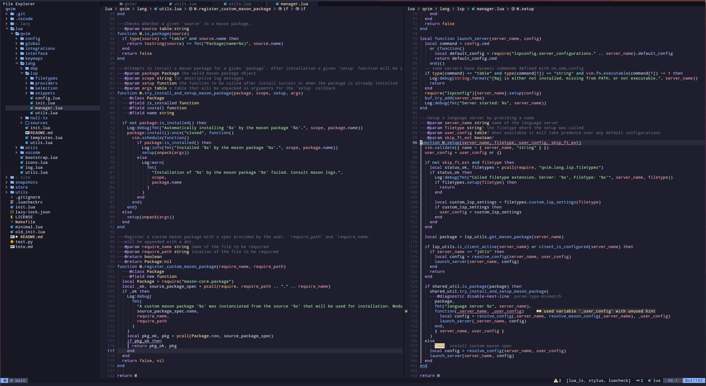

# QuantumVim



## Disclaimer

Heavily inspired by [LunarVim](https://github.com/LunarVim/LunarVim)!

**[QuantumVim](https://github.com/quantumfate/qvim) was never meant to be a neovim distribution nor will it ever be.** This configuration is just my overkill take on how to setup a strong core by finding the righ mix of maintainability, stability and performance. Some things that I've implemented already exist as plugins, or could have been done differently with less runtime but the idea is that it would always allow me to migrate to a different plugin, with little effort, once something breaks.

## Dependencies

- [ripgrep](https://github.com/BurntSushi/ripgrep)
- zip
- wget

## Features

- automatically setup everything needed for a filetype (dap, lsp, linters, formatting, diagnostics)
- scalable keymap declaration with minimal effort

### Languages

Checkout the [Languages section](./lua/qvim/lang/README.md)

## Install

### HTTPS

- currently only on linux and mac

```bash
bash <(curl -s https://raw.githubusercontent.com/quantumfate/quantumvim/main/utils/installer/install.sh)
```

### SSH

```bash
bash <(curl -s https://raw.githubusercontent.com/quantumfate/quantumvim/main/utils/installer/install.sh) --ssh
```

## Run and runtime

Run QuantumVim by `qvim` instead of `nvim`. The runtime/configuration files are located in `~/.config/qvim/`
